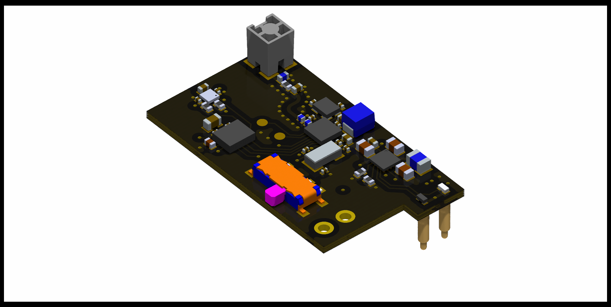
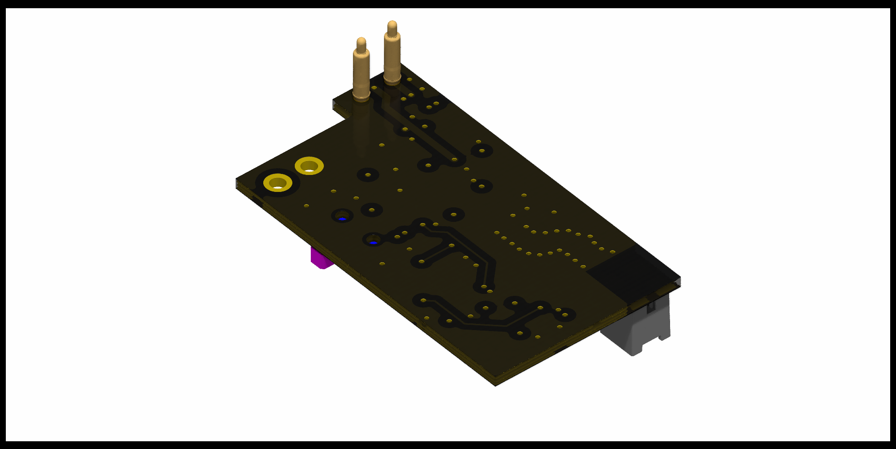

# daemon_full_body_tracker

## Note
board_v1 can't work, because the BHI360 needs firmware to be send over SPI, but the nRF52805 only has a flash storage capability of 24kB, and no external flash IC is on the board. there are other problems aswell, but all of them will be addressed in board_v2

# firmware

for understanding devicetree and bindings: https://github.com/lmapii/practical-zephyr/tree/main