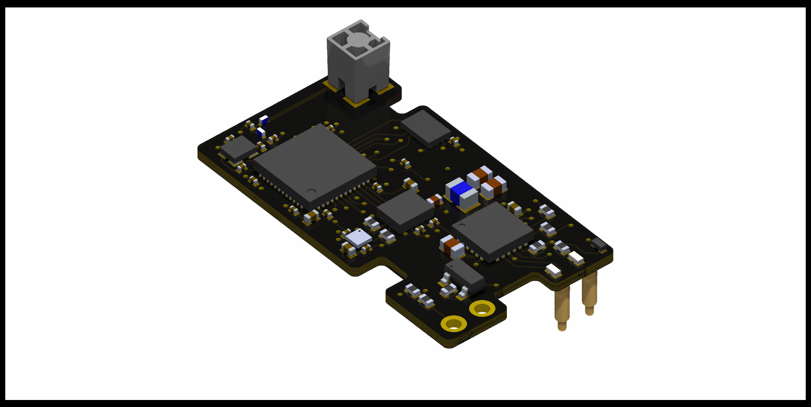
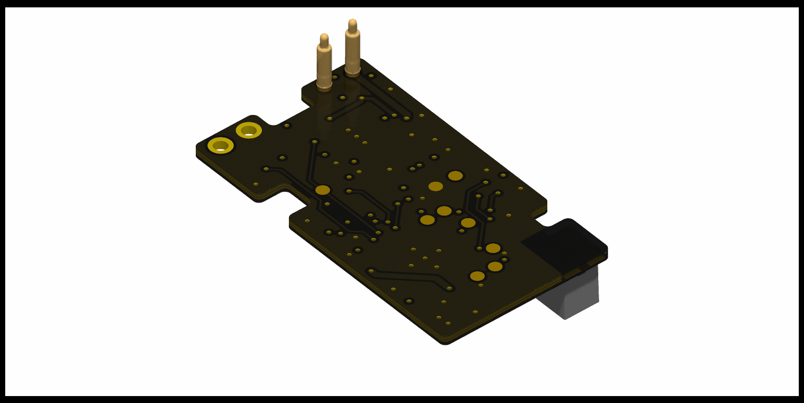

# current version:

## Note
board_v1 can't work, because the BHI360 needs firmware to be send over SPI, but the nRF52805 only has a flash storage capability of 24kB, and no external flash IC is on the board. there are other problems aswell, but all of them will be addressed in board_v2

# firmware
for understanding devicetree and bindings: https://github.com/lmapii/practical-zephyr/tree/main

# notes
to listen to UART: 
minicom -D /dev/ttyUSB0

update firmware over UART with: 
mcumgr-client -d /dev/ttyUSB0 -b 460800 upload build/zephyr/app_update.bin

list with:
mcumgr --conntype serial --connstring "/dev/ttyUSB0,baud=460800" image list

confirm with:
mcumgr --conntype serial --connstring "/dev/ttyUSB0,baud=460800" image confirm c14c40bec9b925ec950af9ccbd3282b68765baeb21c8a0d2d524de6d4da6c468

mcumgr-client -d /dev/ttyUSB0 -b 460800 reset

# NOTE: disabled error handling for "match transceive(&mut *port, &chunk)" in 
