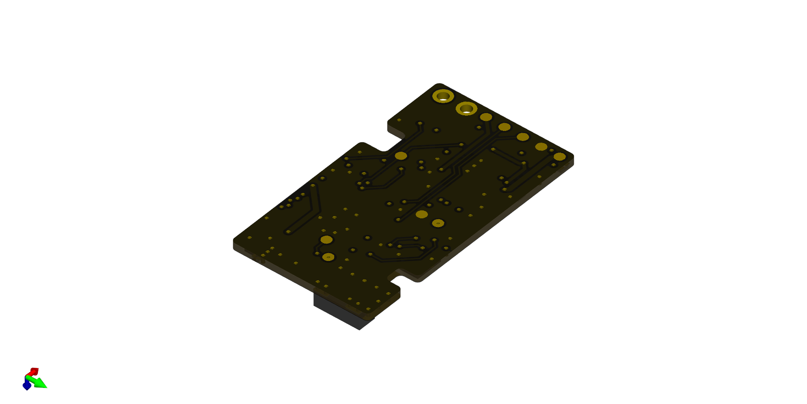

# current version (tracker):

# current version (charger/updater):

# firmware
for understanding devicetree and bindings: https://github.com/lmapii/practical-zephyr/tree/main

# notes
to listen to UART: 
minicom -D /dev/ttyUSB0

update firmware over UART with: 
mcumgr-client -d /dev/ttyUSB0 -b 460800 upload build/zephyr/app_update.bin

list with:
mcumgr --conntype serial --connstring "/dev/ttyUSB0,baud=460800" image list

confirm with:
mcumgr --conntype serial --connstring "/dev/ttyUSB0,baud=460800" image confirm c14c40bec9b925ec950af9ccbd3282b68765baeb21c8a0d2d524de6d4da6c468

mcumgr-client -d /dev/ttyUSB0 -b 460800 reset

# NOTE: disabled error handling for "match transceive(&mut *port, &chunk)" in 
